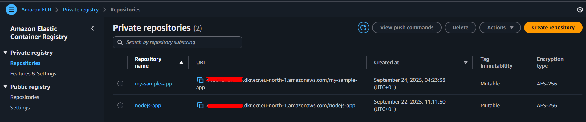
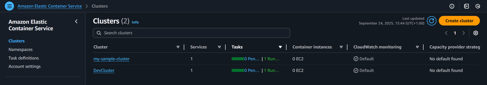
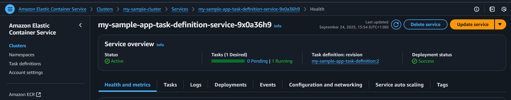
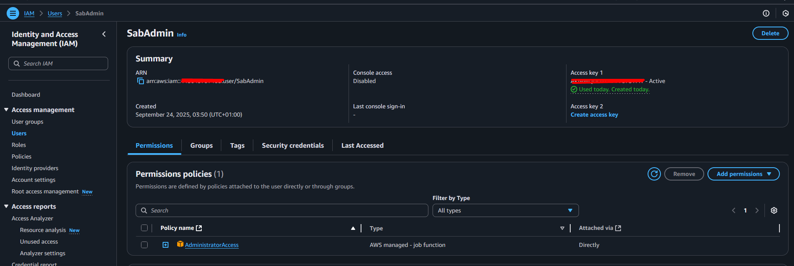
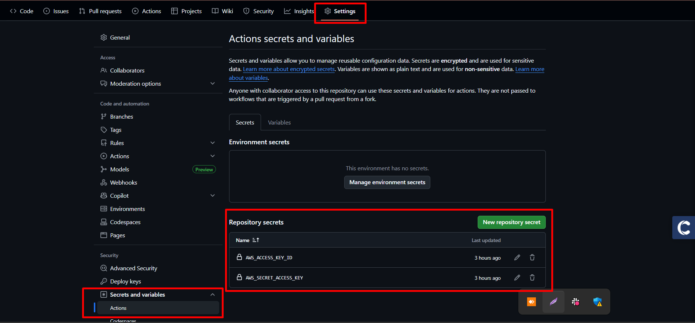
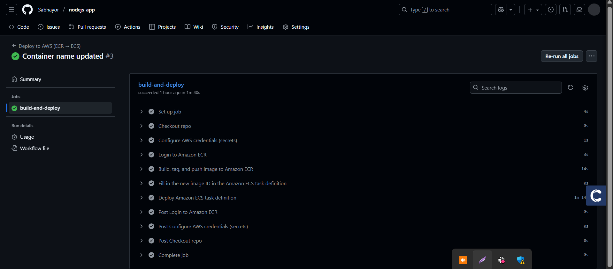
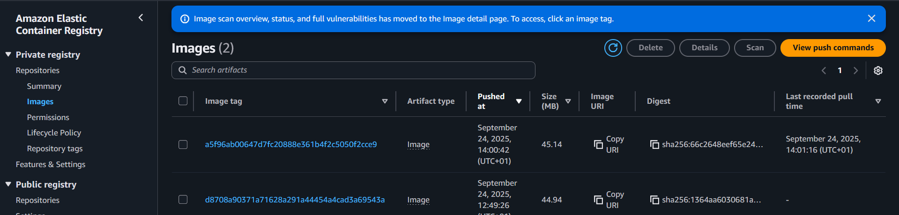

# 🚀 Deploying Applications to AWS Cloud with GitHub Actions

This project demonstrates how to **deploy a simple Node.js application** to **AWS ECS (Fargate) using ECR** as the container registry, with **GitHub Actions** handling CI/CD.

---

## 📌 Project Overview
We will:
1. Build a Node.js app.
2. Dockerize it with a `Dockerfile`.
3. Push the container image to **Amazon ECR**.
4. Deploy the image to **Amazon ECS Fargate**.
5. Automate all steps via **GitHub Actions**.

---

## 🛠️ Prerequisites
- AWS account with permissions to create ECS, ECR, IAM resources.
- GitHub repository for storing code.
- Docker & AWS CLI (optional, for local testing).
- GitHub Secrets for authentication.

---

## 📂 Project Structure
```
.
├── app.js
├── package.json
├── Dockerfile
└── .github/
    └── workflows/
        └── deploy-to-aws.yml
```

---

## 📜 Step 1: Create a Sample App

**app.js**
```js
const http = require('http');
const port = process.env.PORT || 8080;

const server = http.createServer((req, res) => {
  res.writeHead(200, { 'Content-Type': 'text/plain' });
  res.end('Hello from ECS + GitHub Actions!\n');
});

server.listen(port, () => {
  console.log(`Listening on port ${port}`);
});
```

**package.json**
```json
{
  "name": "sample-ecs-app",
  "version": "1.0.0",
  "main": "app.js",
  "scripts": {
    "start": "node app.js"
  }
}
```

---

## 📜 Step 2: Create Dockerfile

**Dockerfile**
```dockerfile
FROM node:18-alpine
WORKDIR /app
COPY package*.json ./
RUN npm ci --only=production
COPY . .
EXPOSE 8080
CMD ["node", "app.js"]
```

---

## ☁️ Step 3: AWS Setup
1. Create an **ECR Repository** (e.g. `my-sample-app`).  



2. Create an **ECS Cluster** (e.g. `my-sample-cluster`).  



3. Create an **ECS Service** to run the app.  



4. Create an **IAM User** (AWS keys) with ECR + ECS permissions.  



   - Copy the **AWS_ACCESS_KEY_ID** and **AWS_SECRET_ACCESS_KEY**.  


---

## 🔑 Step 4: Add GitHub Secrets
In your GitHub repo:
- Go to **Settings → Secrets → Actions**.
- Add:
  - `AWS_ACCESS_KEY_ID`
  - `AWS_SECRET_ACCESS_KEY`  

  

---

## 🤖 Step 5: GitHub Actions Workflow

Create `.github/workflows/deploy-to-aws.yml`:

```yaml
name: Deploy to AWS (ECR → ECS)

on:
  push:
    branches:
      - main

jobs:
  build-and-deploy:
    runs-on: ubuntu-latest

    steps:
      - name: Checkout repo
        uses: actions/checkout@v4

      - name: Configure AWS credentials (secrets)
        uses: aws-actions/configure-aws-credentials@v5
        with:
          aws-access-key-id: ${{ secrets.AWS_ACCESS_KEY_ID }}
          aws-secret-access-key: ${{ secrets.AWS_SECRET_ACCESS_KEY }}
          aws-region: 'eu-north-1'

      - name: Login to Amazon ECR
        id: login-ecr
        uses: aws-actions/amazon-ecr-login@v2
        with:
          mask-password: 'true'
          
      - name: Build, tag, and push image to Amazon ECR
        id: build-image
        env:
          ECR_REGISTRY: ${{ steps.login-ecr.outputs.registry }}
          IMAGE_TAG: ${{ github.sha }}
          REPOSITORY: my-sample-app
        run: |
          # Build a docker container and
          # push it to ECR so that it can
          # be deployed to ECS.
          docker build -t $ECR_REGISTRY/$REPOSITORY:$IMAGE_TAG .
          docker push $ECR_REGISTRY/$REPOSITORY:$IMAGE_TAG
          echo "image=$ECR_REGISTRY/$REPOSITORY:$IMAGE_TAG" >> $GITHUB_OUTPUT  

      - name: Fill in the new image ID in the Amazon ECS task definition
        id: task-def
        uses: aws-actions/amazon-ecs-render-task-definition@v1
        with:
          task-definition: my-sample-app-task-definition.json
          container-name: my-sample-app-task-definition
          image: ${{ steps.build-image.outputs.image }}   

      - name: Deploy Amazon ECS task definition
        uses: aws-actions/amazon-ecs-deploy-task-definition@v2
        with:
          task-definition: ${{ steps.task-def.outputs.task-definition }}
          service: my-sample-app-task-definition-service-9x0a36h9
          cluster: my-sample-cluster
          wait-for-service-stability: true    
```

---

## ✅ Step 6: Deploy
1. Commit your code & workflow file.
2. Push to `main` branch.
3. Check **Actions** tab in GitHub → You’ll see the workflow run.  



4. ECS will redeploy with the new image.  




---

## 🔍 Step 7: Verify Deployment
- Go to **AWS ECS Console** → Check if new tasks are running.
- If using a load balancer, visit the public DNS → you should see `Hello from ECS + GitHub Actions!`.  


---

## ⚠️ Notes
- Replace `us-west-2`, `my-sample-cluster`, `my-sample-service`, and `my-sample-app` with your actual values.
- GitHub Secrets are sensitive → never commit AWS keys in code.
- For production, use **OIDC** instead of long-lived AWS keys.

---

## 🎯 Conclusion
You now have a full CI/CD pipeline:
- GitHub Actions builds & pushes Docker images.
- ECS automatically redeploys with the latest image.
- Your app is live on AWS 🚀.

